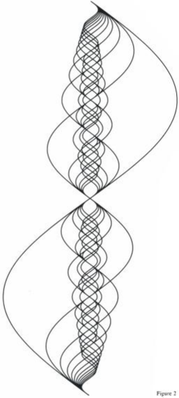
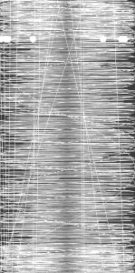

## Harmony




| 01 -  Wrong map range                                        | 02 - Wrong variable in sin                                   | 03 -  Worked!                                                |
| :----------------------------------------------------------- | ------------------------------------------------------------ | ------------------------------------------------------------ |
|                                         |                                         |                                         |
| ```float x = ofMap(sin(time*frequency )*amplitude, -amplitude, amplitude, 0, ofGetWidth());``` | ` float x = ofMap(sin(time * M_PI * 2 / period ), -1, 1, 0, ofGetWidth());` | `    float x = ofMap(sin(y * frequency * M_PI * 2 / period ) *amplitude, -1, 1, 0, ofGetWidth());` |
| ` -amplitude, amplitude` range should have been `-1, 1`      | instead of `time` use `y` value.                             |                                                              |
