#### Table of Contents

- [Week 1 - Vera Molnar](#week-1---vera-molnar)
  - [Carrés en 2 positions](#carrés-en-2-positions)
  - [Computer-rosace-series](#computer-rosace-series)
  - [de la serie 100 carres](#de-la-serie-100-carres)
  - [du cycle inclinaisions](#du-cycle-inclinaisions)
  - [Horizontales](#horizontales)
  - [Sainte-Victoire On Line](#sainte-victoire-on-line)
- [Week 2 - John Whitney](#week-2---john-whitney)
  - [Harmony](#harmony)
  - [Lissajous-curve](#lissajous-curve)
  - [Matrix III](#matrix-iii)
  - [Catalog](#catalog)


## Week 1 - Vera Molnar 

### Carrés en 2 positions 

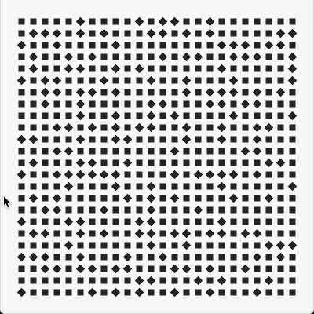

### Computer-rosace-series

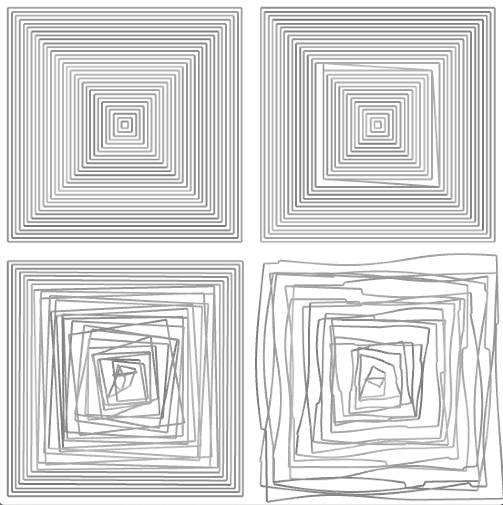

### de la serie 100 carres

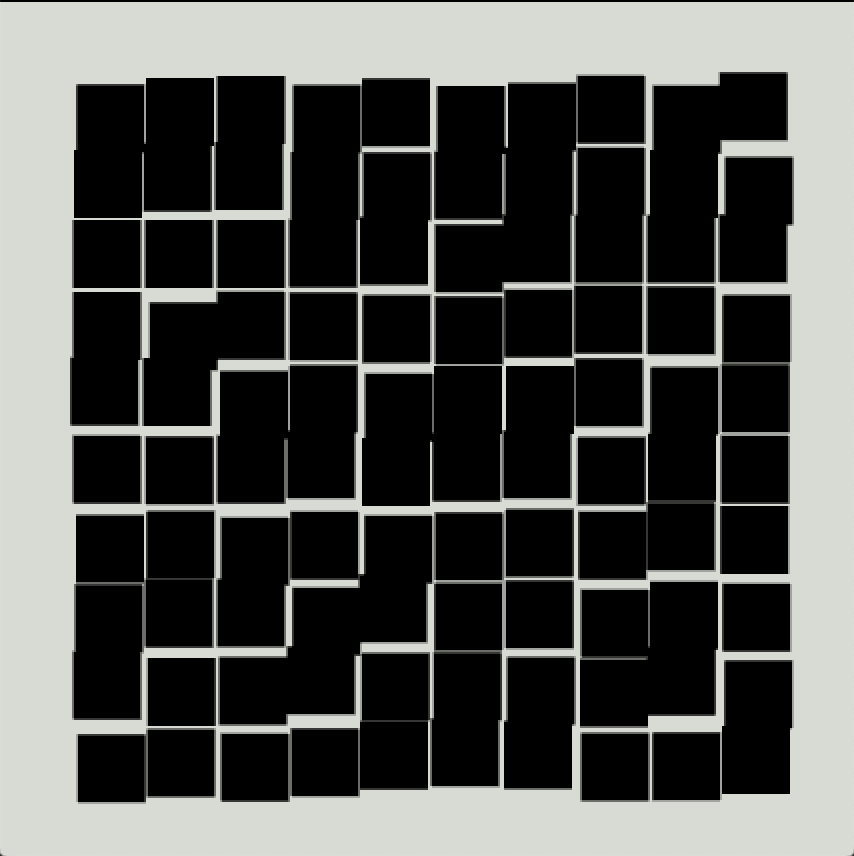


### du cycle inclinaisions

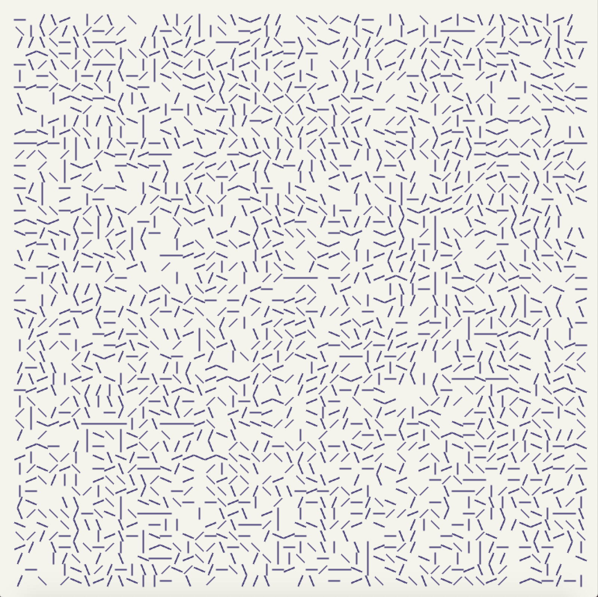


### Horizontales


### Sainte-Victoire On Line

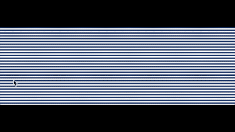

## Week 2 - John Whitney

### Harmony


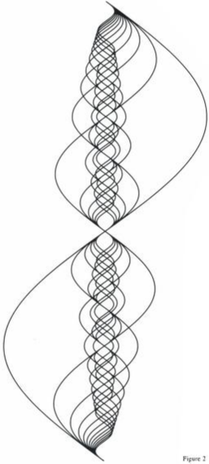

| 01 -  Wrong map range                                                                          | 02 - Wrong variable in sin                                                  | 03 -  Worked!                                                                                      |
| :--------------------------------------------------------------------------------------------- | --------------------------------------------------------------------------- | -------------------------------------------------------------------------------------------------- |
| 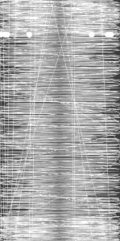                                                |                              | 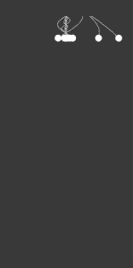                                                    |
| ```float x = ofMap(sin(time*frequency )*amplitude, -amplitude, amplitude, 0, ofGetWidth());``` | ` float x = ofMap(sin(time * M_PI * 2 / period ), -1, 1, 0, ofGetWidth());` | `    float x = ofMap(sin(y * frequency * M_PI * 2 / period ) *amplitude, -1, 1, 0, ofGetWidth());` |
| ` -amplitude, amplitude` range should have been `-1, 1`                                        | instead of `time` use `y` value.                                            |                                                                                                    |

### Lissajous-curve

Recreating the below curve table:

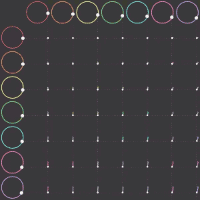

Equation: 

The table is changing two parameters **a** and **b**.

Rows are increasing the **a** value from top to down. Range is [1,7]

Columns are increasing the **b** value from left to right . Range is [1,7]


| 01 - no grid                                            | 02 - wrong spacing at grid                              | 03 - worked!                                            |
| ------------------------------------------------------- | ------------------------------------------------------- | ------------------------------------------------------- |
|  | 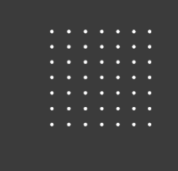 | 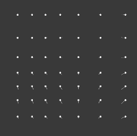 |

**01 code snippet**

```c++
    float t = ofGetElapsedTimef();
    float width = ofGetWidth();
    float height = ofGetHeight();
    for(int i=1; i< 8; i++)
    {
        for(int j=1; j<8; j++)
        {
            float x = ofMap(sin(i * t + M_PI * 0.5), -1, 1, 0, width);
            float y = ofMap(sin(j * t ), -1, 1, 0, height) ;
            ofDrawCircle(x, y, 5);
        }
    }
```


**03 code snippet**

```c++
    for(int i=1; i< 8; i++)
    {
        for(int j=1; j<8; j++)
        {
            float x = ofMap(sin(i * t + M_PI * 0.5), -1, 1, 0, cellW) + cellW* (i-1);
            float y = ofMap(sin(j * t ), -1, 1, 0, cellH) + cellH*(j-1) ;
            
            ofDrawCircle(x, y, 5);
        }
    }
```

### Matrix III

recreating snippets of [Matrix III - John whitney](https://www.youtube.com/watch?v=ZrKgyY5aDvA)


| 01                                                 | 02                                                                                                                                                                | 03                                                                                                                  |
| -------------------------------------------------- | ----------------------------------------------------------------------------------------------------------------------------------------------------------------- | ------------------------------------------------------------------------------------------------------------------- |
|  |                                                                                                                 |                                                                   |
|                                                    | removing the **i** from equation made them align too much. Also they should have collapsed in the middle but because of `+ M_PI * 0.5`  it collapsed on the side. | This version is closer to the original but they align to a lign before collapsing instead of coming from all sides. |


**01 code snippet**

```c++
for(int i=0; i< 24; i++)
    {
        float scale = ofMap(i, 0, 80, 0, 10);

        float x = ofMap(sin(3 * (t*scale +i) + M_PI * 0.5),
                        -1, 1,
                        centerX - width/2, centerX + width/2);
        float y = ofMap(sin(2 * (t*scale +i) ),
                        -1, 1,
                        centerY - height/2, centerY + height/2) ;
  
        ofSetLineWidth(2);
        drawHexagon(x, y, ofMap(sin(t + i * 0.1), -1, 1, 20, 200));
    }
```

### Catalog

recreating snippets of [Catalog](https://youtu.be/TbV7loKp69s?t=225)

**Creating the basic shape**

I studied the fan like shape using Figma. 

| 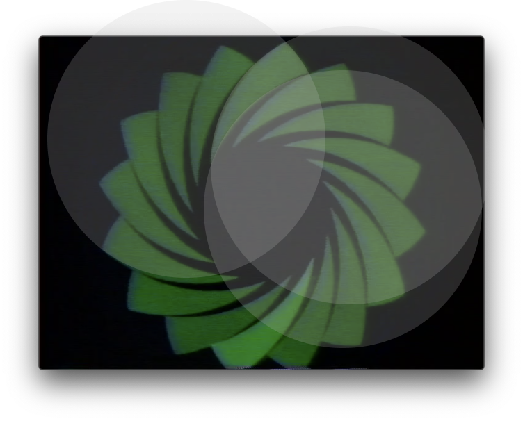       | 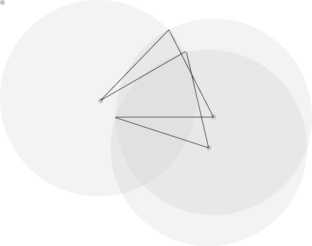                       |
| ------------------------------------------------------------- | ----------------------------------------------------------------------------- |
| I first placed circles to create the shape as an intersection | Then found the origin points and the angles to recreate the arcs using ofPath |

```c++
    ofPath path;
		path.arcNegative(420-290,296-120, 200, 200, 257, 198);
    path.arc        (430-290,233-120, 200, 200, 180, 243);
    path.arc        (200-290,200-120, 200, 200, 314, 332);
    path.close();
    path.setCircleResolution(120);
    path.setPolyWindingMode((ofPolyWindingMode) 2);
    
```

above code snippet renders the following shape

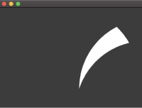

Code details:

- in order to move the shape origin to the middle every center point is offsetted by **(290,120)**. 
- **arc** draws the path in *clockwise* and **arcNegative** in *counter-clockwise*
- whole shape is drawn in *clockwise* 
- Tried different **PolyWindingMode**s and decided on using *OF_POLY_WINDING_POSITIVE* (2) which closed the path without artefacts.

**Iterations**

| 01                                                                                                                          | 02                                                               |
| --------------------------------------------------------------------------------------------------------------------------- | ---------------------------------------------------------------- |
| 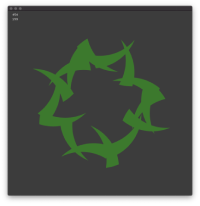                                                                             |                   |
| The position of the arcs are correct but couldn't figure out the rotation yet. The pivot was not set properly for rotation. | The **mouseX** position is used to change the size of the shape. |

**02**

- used  ` ofEnableBlendMode(OF_BLENDMODE_ADD)` to make the overlapping regions emit more light
- used a **fragment shader** to color parts of the ofPath 

